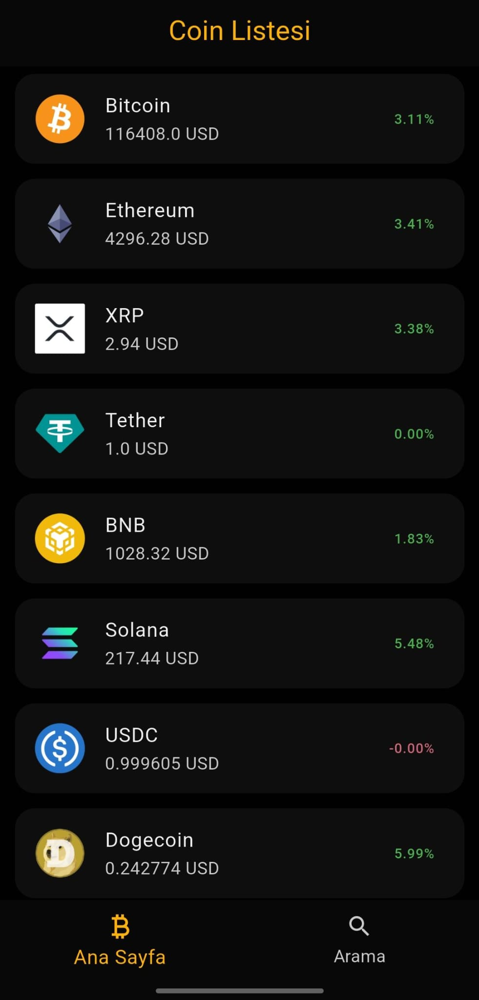
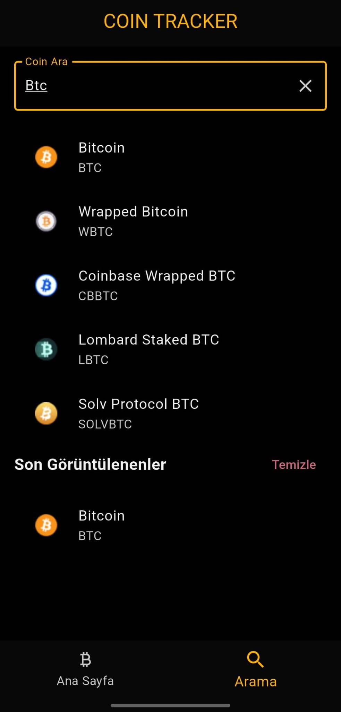
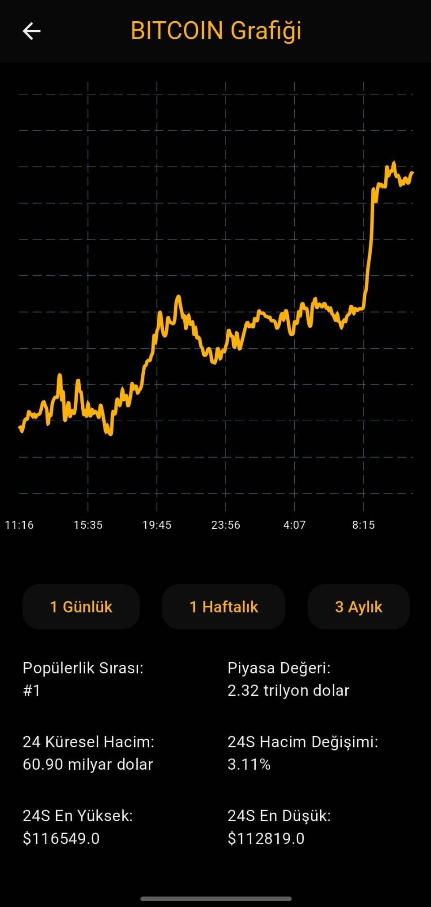

# CoinTracker

Flutter ile geliştirilen **kripto para takip** uygulaması. Canlı/son fiyatlar, yüzdesel değişimler, detay ekranı ve (isteğe bağlı) favoriler & arama özelliklerini örneklemek için hazırlanmıştır.


## Özellikler
- ✅ Liste ekranında popüler coin’lerin **fiyat**, **24s değişim (%)**, **piyasa değeri** gibi özet alanlarını gösterme
- ✅ Detay ekranında coin özelinde **grafik** (opsiyonel), **açıklama**, **favoriye ekleme/çıkarma**
- ✅ **Arama** ve **sıralama/filtreleme** (ör. en çok yükselen/düşen)
- ✅ **Karanlık/Açık tema** desteği (Flutter Theme)
- ✅ Çoklu platform: Android, iOS, Web, (isteğe bağlı) masaüstü


## Ekran Görüntüleri


<p float="left">
  
  
  
</p>

## Mimari ve Kullanılan Paketler
- **Flutter** çoklu platform
- Temel akış: `UI` → `State/Model` → `Data/Service`
- Durum yönetimi: _Provider / Riverpod / Bloc_ (kullandığın yönteme göre doldur)
- Grafik: _fl_chart / charts_flutter / custom painter_ (varsa)
- Yerel depolama: _SharedPreferences / Hive_ (favoriler, ayarlar için)
- HTTP/İstemci: _http / dio_

## Kurulum
1. **Flutter** kurulu olmalı (3.x+): <https://docs.flutter.dev/get-started/install>
2. Depoyu klonla:
   ```bash
   git clone https://github.com/Yido1007/cointracker.git
   cd cointracker
   ```
3. Bağımlılıkları indir:
   ```bash
   flutter pub get
   ```
4. (Opsiyonel) Ortam değişkenleri/API anahtarı gerekiyorsa `.env` oluştur:
   ```bash
   cp .env.example .env
   # anahtarları ve base URL'leri doldur
   ```

## Çalıştırma
```bash
# cihazları listele
flutter devices

# varsayılan cihaza çalıştır
flutter run

# belirli platform
flutter run -d chrome   # Web
flutter run -d android  # Android
flutter run -d ios      # iOS
```

## Build
```bash
# Android
flutter build apk
flutter build appbundle

# iOS (release)
flutter build ios

# Web (release)
flutter build web
```

## Proje Yapısı
Aşağıdaki şema tipik bir düzeni örnekler; repodaki gerçek dizinlere göre güncelle.
```
cointracker/
├─ lib/
│  ├─ main.dart
│  ├─ core/              # tema, renkler, sabitler, util
│  ├─ data/
│  │  ├─ models/         # Coin, MarketData vb.
│  │  └─ repositories/   # veri erişim arayüzleri
│  ├─ services/          # API istemcileri (dio/http), local cache
│  ├─ features/
│  │  ├─ list/           # liste ekranı + state
│  │  └─ details/        # detay ekranı + grafikler
│  └─ widgets/           # ortak bileşenler
├─ assets/               # fonts, images, screenshots
├─ pubspec.yaml
└─ README.md
```

## Kalite (Lint/Format/Test)
```bash
# format
dart format .

# linter (ör: pedantic / lints)
flutter analyze

# test
flutter test
```


## Yol Haritası
- [ ] Favori coin’ler ve yerel kalıcılık
- [ ] Çoklu para birimi (USD/EUR/TRY) ve yerelleştirme
- [ ] Gelişmiş grafikler (1s/24s/7g/30g)
- [ ] Haber akışı entegrasyonu
- [ ] CI (GitHub Actions) + otomatik format/lint
- [ ] Widget/golden testler

## Katkı
Katkılar memnuniyetle kabul edilir!
1. Bir **issue** aç veya **fork**la.
2. Dal oluştur: `feat/kisa-aciklama`
3. Lint/testleri çalıştır.
4. Açıklayıcı bir PR gönder.
